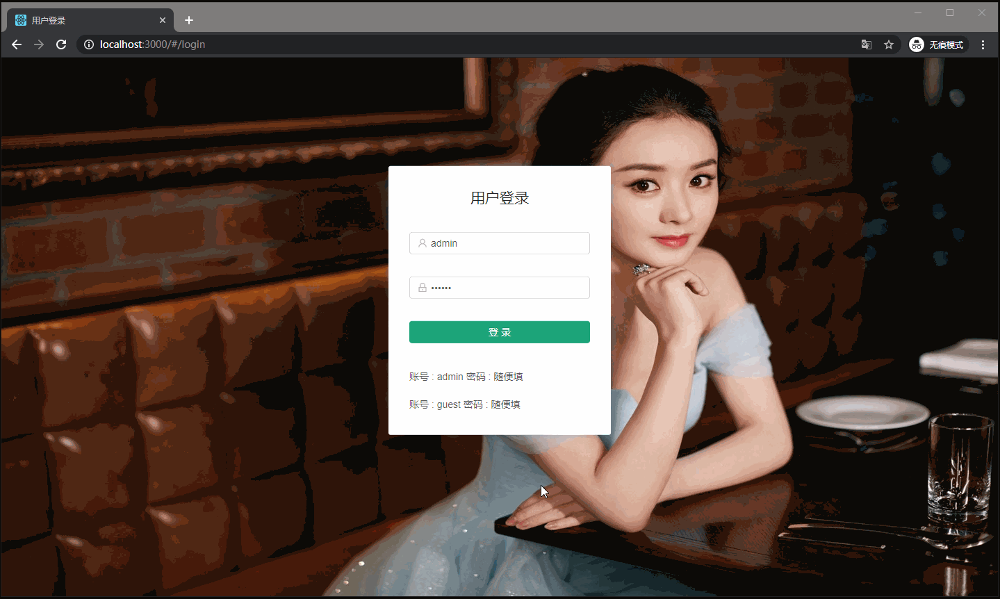

<p align="center">
   <a href="https://nlrx-wjc.github.io/react-antd-admin-template/" target="_blank">
      
   </a>
</p>

# 简介

[react-antd-admin-template](https://nlrx-wjc.github.io/react-antd-admin-template/) 是一个基于 `React` 和 `Ant Design` 的后台管理系统模板。它内置了用户登录/登出，动态路由，权限校验，用户管理等典型的业务模型，可以帮助你快速搭建企业级中后台产品原型，是你接私活的不二之选。

本系统的开发灵感来自 [vue-element-admin](https://github.com/PanJiaChen/vue-element-admin/) ，这是一个基于 `Vue` 和 `ElementUI` 的优秀的后台管理系统模板，在这里向大佬致敬！

其实我的主技术栈一直是 `Vue`，只是最近入坑了 `React` ，看了大半个月文档，就想牛刀小试一下，哈哈。不是有那句话么：检验学习成果最好的方式就是造轮子。所以就造了这么个轮子，哈哈。对于 `React` ，我还是个小白，项目中肯定有做的不够好的地方，欢迎各位同好提 `pr` 或 `issue` 。

- [在线预览](https://nlrx-wjc.github.io/react-antd-admin-template/)
- [Gitee在线预览(国内用户可访问该地址)](https://nlrx.gitee.io/react-antd-admin-template/)
- [开发文档](https://nlrx-wjc.github.io/react-antd-admin-template-doc/) 目前还在持续编写完善中...

# 功能

```bash
- 登录 / 注销

- 权限验证
  - 页面权限
  - 路由权限

- 全局功能
  - 动态侧边栏（支持多级路由嵌套）
  - 动态面包屑
  - 本地/后端 mock 数据
  - Screenfull全屏
  - 自适应收缩侧边栏

- 编辑器
  - 富文本
  - Markdown

- Excel
  - 导出excel
  - 导入excel
  - 前端可视化excel

- Zip
  - 导出zip

- 错误页面
  - 404

- 组件
  - 拖拽列表

- 表格
- Dashboard
- 引导页
- ECharts 图表
- 剪贴板
```

# 目录结构

```bash
├─ public                     # 静态资源
│   ├─ favicon.ico            # favicon图标
│   └─ index.html             # html模板
├─ src                        # 项目源代码
│   ├─ api                    # 所有请求
│   ├─ assets                 # 图片 字体等静态资源
│   ├─ components             # 全局公用组件
│   ├─ config                 # 全局配置
│   │   ├─ menuConfig.js      # 导航菜单配置
│   │   └─ routeMap.js        # 路由配置
│   ├─ lib                    # 第三方库按需加载
│   ├─ mock                   # 项目mock 模拟数据
│   ├─ store                  # 全局 store管理
│   ├─ styles                 # 全局样式
│   ├─ utils                  # 全局公用方法
│   ├─ views                  # views 所有页面
│   ├─ App.js                 # 入口页面
│   ├─ defaultSettings.js     # 全局默认配置
│   └─index.js                # 源码入口
├── .env.development          # 开发环境变量配置
├── .env.production           # 生产环境变量配置
├── config-overrides.js       # 对cra的webpack自定义配置
├── deploy.sh                 # CI部署脚本
├── .travis.yml               # 自动化CI配置
└── package.json              # package.json
```

# 安装

```shell
# 克隆项目
git clone https://github.com/NLRX-WJC/react-antd-admin-template.git

# 进入项目目录
cd react-antd-admin-template

# 安装依赖
npm install

# 切换淘宝源，解决 npm 下载速度慢的问题
npm install --registry=https://registry.npm.taobao.org

# 启动服务
npm start
```

启动完成后会自动打开浏览器访问 [http://localhost:3000](http://localhost:3000)， 你看到下面的页面就代表操作成功了。



接下来你可以修改代码进行业务开发了。

# 关于作者

大家好，我是难凉热血。

终南山下码农一枚，师从道长王重阳，酷爱打码，崇尚开源精神，乐于分享。

2005年服役于中国人民解放军东南战区狼牙特种大队，担任狙击手。

2008年受俄罗斯阿尔法特种部队邀请，执教于该特种部队第一大队教授其队员学习中国特色社会主义理论及毛泽东思想。

2011年竞选美国总统落选，遂心灰意冷，放下所有荣誉，隐居终南山下。

2015年受道长王重阳委托，为道观开发香火管理系统，遂沉迷IT，无法自拔。

喜欢折腾和搞机，追求新鲜技术。

下边是我的微信，欢迎同好伙伴一起树(tree)新(new)风(bee)！！！


# 鼓励作者

作为个人开发者，维护开源实属不易。如果您觉得本项目对你有些许帮助的话，还请帮忙点个 star 哈~~
如果您有余力的话也非常感谢您对我的赞赏，您的赞赏，是对我创作最大的认可和鼓励。

